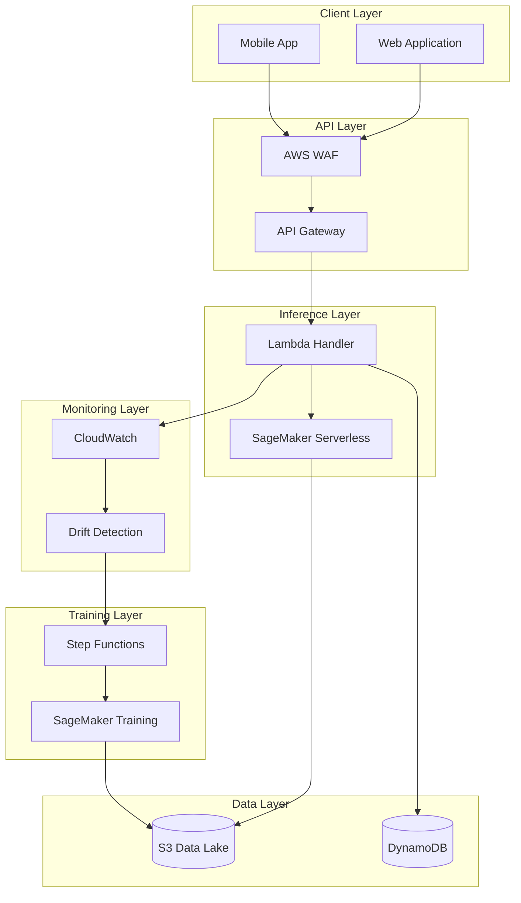
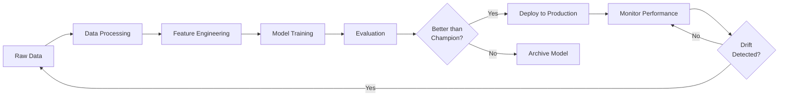

# ML-Powered Product Recommendation System

[](https://opensource.org/licenses/MIT)
[](https://www.python.org/downloads/)
[](https://aws.amazon.com/)
[](https://www.terraform.io/)
[](https://github.com/psf/black)

> **Enterprise-grade ML recommendation system built on AWS serverless architecture with full MLOps automation**

## 📋 Table of Contents

- [Overview](#overview)
- [Key Features](#key-features)
- [Architecture](#architecture)
- [Quick Start](#quick-start)
- [Documentation](#documentation)
- [Project Structure](#project-structure)
- [Technology Stack](#technology-stack)
- [Development](#development)
- [Deployment](#deployment)
- [Monitoring](#monitoring)
- [Contributing](#contributing)
- [License](#license)

## 🎯 Overview

This project implements a **production-ready ML-powered product recommendation system** for e-commerce platforms. It demonstrates the complete ML lifecycle from data preparation to deployment, monitoring, and automated retraining.

The system uses a **hybrid recommendation approach** combining collaborative filtering and content-based filtering to provide personalized product recommendations via a REST API.

### Business Value

- **Increased Revenue**: Personalized recommendations drive 15-30% increase in conversion rates
- **Enhanced User Experience**: Relevant product suggestions improve customer satisfaction
- **Scalable Architecture**: Serverless design handles variable traffic without over-provisioning
- **Automated Operations**: MLOps automation reduces operational overhead by 70%

### Use Case

Build a recommendation engine that:
- ✅ Predicts products users are likely to purchase based on browsing history
- ✅ Provides personalized recommendations via low-latency API (<100ms p95)
- ✅ Continuously improves through automated retraining on new data
- ✅ Monitors model performance and detects data drift
- ✅ Supports A/B testing between model versions

## ✨ Key Features

### ML Capabilities
- **Hybrid Recommendation Model**: Neural Collaborative Filtering + Content-Based Filtering
- **Cold Start Handling**: Popularity-based and category-based fallbacks
- **Real-time Inference**: <100ms latency via SageMaker Serverless Inference
- **Automated Retraining**: Weekly scheduled retraining + drift-triggered retraining
- **A/B Testing**: Champion/Challenger framework for model comparison

### MLOps & Infrastructure
- **Infrastructure as Code**: 100% Terraform-managed AWS resources
- **CI/CD Automation**: GitHub Actions for testing, training, and deployment
- **Monitoring & Alerting**: CloudWatch dashboards, alarms, and drift detection
- **Security**: Encryption at rest/transit, IAM least privilege, API key authentication
- **Scalability**: Serverless architecture auto-scales from 0 to 10,000+ req/s

### Data Pipeline
- **Automated ETL**: AWS Glue for data processing and feature engineering
- **Data Quality**: Automated validation, completeness, and freshness checks
- **Feature Store**: S3-based feature storage with versioning
- **Temporal Splitting**: Train/val/test splits preserve temporal ordering

## 🏗️ Architecture

### High-Level Architecture



For detailed architecture diagrams and component descriptions, see [Architecture Documentation](docs/ARCHITECTURE.md).

### ML Pipeline Workflow



## 🚀 Quick Start

### Prerequisites

- **AWS Account** with appropriate permissions
- **Python 3.11+**
- **Terraform 1.5+**
- **AWS CLI** configured
- **Docker** (for local testing)

### Installation

1. **Clone the repository**:
```bash
git clone https://github.com/yourusername/machinelearningAWS-project.git
cd machinelearningAWS-project
```

2. **Set up Python environment**:
```bash
python -m venv venv
source venv/bin/activate  # On Windows: venv\Scripts\activate
pip install -r requirements.txt
pip install -r requirements-dev.txt
```

3. **Configure AWS credentials**:
```bash
aws configure
# Enter your AWS Access Key ID, Secret Access Key, and region
```

4. **Initialize Terraform**:
```bash
cd terraform/environments/dev
terraform init
```

### Local Development

1. **Generate sample data**:
```bash
python scripts/generate_sample_data.py --num-users 1000 --num-products 500
```

2. **Train model locally**:
```bash
python src/training/train.py \
  --data-path data/processed \
  --model-dir models/local \
  --num-epochs 10
```

3. **Test inference locally**:
```bash
python src/api/lambda_handler.py --local
```

### Deploy to AWS

1. **Deploy infrastructure**:
```bash
cd terraform/environments/dev
terraform plan -out=tfplan
terraform apply tfplan
```

2. **Deploy model**:
```bash
python scripts/deploy_model.py \
  --model-version v1.0.0 \
  --environment dev
```

3. **Test API**:
```bash
curl -X POST https://api-dev.example.com/v1/recommend \
  -H "X-API-Key: your_api_key" \
  -H "Content-Type: application/json" \
  -d '{
    "user_id": "user_123",
    "num_recommendations": 10
  }'
```

## 📚 Documentation

Comprehensive documentation is available in the `docs/` directory:

| Document | Description |
|----------|-------------|
| [Getting Started](docs/GETTING_STARTED.md) | Step-by-step setup and deployment guide |
| [Architecture](docs/ARCHITECTURE.md) | System architecture, components, and design decisions |
| [Data Pipeline](docs/DATA_PIPELINE.md) | Data ingestion, processing, and feature engineering |
| [Model Development](docs/MODEL_DEVELOPMENT.md) | Model architecture, training, and evaluation |
| [Deployment](docs/DEPLOYMENT.md) | Deployment strategies, CI/CD, and rollback procedures |
| [Monitoring](docs/MONITORING.md) | Monitoring, alerting, drift detection, and operations |
| [API Reference](docs/API_REFERENCE.md) | Complete API documentation with examples |
| [Security](docs/SECURITY.md) | Security architecture, compliance, and best practices |
| [Cost Analysis](docs/COST_ANALYSIS.md) | AWS cost estimates and optimization strategies |

## 📁 Project Structure

```
machinelearningAWS-project/
├── data/                          # Data storage
│   ├── raw/                       # Raw data from e-commerce platform
│   ├── processed/                 # Cleaned and transformed data
│   └── features/                  # Engineered features
├── src/                           # Source code
│   ├── data_preparation/          # Data loading and preprocessing
│   ├── models/                    # Model implementations
│   ├── training/                  # Training scripts
│   ├── evaluation/                # Evaluation metrics
│   ├── inference/                 # Inference handlers
│   ├── deployment/                # Deployment utilities
│   ├── monitoring/                # Monitoring and drift detection
│   ├── api/                       # API Lambda handlers
│   └── utils/                     # Shared utilities
├── notebooks/                     # Jupyter notebooks for exploration
├── tests/                         # Unit and integration tests
│   ├── unit/                      # Unit tests
│   ├── integration/               # Integration tests
│   └── fixtures/                  # Test fixtures
├── terraform/                     # Infrastructure as Code
│   ├── modules/                   # Reusable Terraform modules
│   │   ├── sagemaker/            # SageMaker resources
│   │   ├── lambda-inference/     # Lambda functions
│   │   ├── api-gateway/          # API Gateway
│   │   ├── ml-pipeline/          # Step Functions
│   │   └── monitoring/           # CloudWatch resources
│   └── environments/              # Environment-specific configs
│       ├── dev/
│       ├── staging/
│       └── prod/
├── .github/                       # GitHub Actions workflows
│   └── workflows/
│       ├── ml-ci.yml             # CI pipeline
│       ├── model-training.yml    # Training automation
│       └── model-deployment.yml  # Deployment automation
├── scripts/                       # Utility scripts
├── docs/                          # Documentation
├── requirements.txt               # Python dependencies
├── requirements-dev.txt           # Development dependencies
├── setup.py                       # Package setup
├── Dockerfile                     # Container for SageMaker
└── README.md                      # This file
```

## 🛠️ Technology Stack

### Machine Learning
- **Framework**: PyTorch 2.0
- **Libraries**: scikit-learn, pandas, numpy
- **Training**: Amazon SageMaker Training Jobs
- **Inference**: SageMaker Serverless Inference

### AWS Services
- **Compute**: AWS Lambda, SageMaker
- **API**: API Gateway (HTTP API)
- **Storage**: S3, DynamoDB
- **Orchestration**: Step Functions
- **Monitoring**: CloudWatch, X-Ray
- **Security**: KMS, Secrets Manager, WAF

### Infrastructure & DevOps
- **IaC**: Terraform
- **CI/CD**: GitHub Actions
- **Containerization**: Docker
- **Testing**: pytest, locust

### Data Processing
- **ETL**: AWS Glue
- **Query**: Amazon Athena
- **Streaming**: Kinesis Data Streams

## 💻 Development

### Running Tests

```bash
# Unit tests
pytest tests/unit/ -v

# Integration tests
pytest tests/integration/ -v

# Coverage report
pytest --cov=src --cov-report=html

# Load tests
locust -f tests/load/locustfile.py
```

### Code Quality

```bash
# Format code
black src/ tests/

# Lint code
flake8 src/ tests/
pylint src/

# Type checking
mypy src/

# Security scanning
bandit -r src/
```

### Pre-commit Hooks

```bash
# Install pre-commit hooks
pre-commit install

# Run manually
pre-commit run --all-files
```

## 🚢 Deployment

### Deployment Environments

| Environment | Purpose | Deployment Trigger |
|-------------|---------|-------------------|
| Development | Feature development | Automatic on push to `develop` |
| Staging | Pre-production testing | Automatic on merge to `main` |
| Production | Live traffic | Manual approval required |

### Deployment Strategies

- **Blue-Green**: For major updates with zero downtime
- **Canary**: For gradual rollout (10% → 50% → 100%)
- **Shadow**: For testing without affecting users

See [Deployment Guide](docs/DEPLOYMENT.md) for detailed procedures.

## 📊 Monitoring

### Key Metrics

**System Performance**:
- API Latency: p50 <100ms, p95 <250ms, p99 <500ms
- Error Rate: <0.1%
- Availability: >99.9%

**ML Model Performance**:
- Click-Through Rate (CTR): >3%
- Conversion Rate: >1.5%
- NDCG@10: >0.45
- Precision@10: >0.35

### Dashboards

Access monitoring dashboards:
- **Operations Dashboard**: CloudWatch dashboard for system metrics
- **ML Performance Dashboard**: Model performance and business metrics
- **Cost Dashboard**: AWS Cost Explorer for cost tracking

See [Monitoring Guide](docs/MONITORING.md) for details.

## 🤝 Contributing

We welcome contributions! Please see our [Contributing Guidelines](CONTRIBUTING.md) for details.

### Development Workflow

1. Fork the repository
2. Create a feature branch (`git checkout -b feature/amazing-feature`)
3. Make your changes
4. Run tests and linting
5. Commit your changes (`git commit -m 'Add amazing feature'`)
6. Push to the branch (`git push origin feature/amazing-feature`)
7. Open a Pull Request

## 📄 License

This project is licensed under the MIT License - see the [LICENSE](LICENSE) file for details.

## 📞 Support

- **Documentation**: [docs/](docs/)
- **Issues**: [GitHub Issues](https://github.com/yourusername/machinelearningAWS-project/issues)
- **Discussions**: [GitHub Discussions](https://github.com/yourusername/machinelearningAWS-project/discussions)

## 🙏 Acknowledgments

- AWS SageMaker team for excellent ML infrastructure
- PyTorch community for the ML framework
- Terraform community for IaC tooling

---

**Built with ❤️ by the ML Engineering Team**
