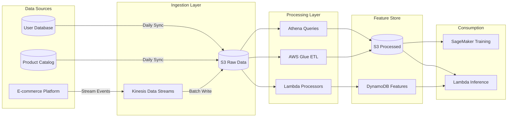

# Data Pipeline Documentation

## Overview
The data pipeline transforms raw e-commerce interaction data into features suitable for training recommendation models. The pipeline is designed to be scalable, reproducible, and monitored.

## Data Flow Architecture



## Data Schema

### 1. User Interactions
**Location**: `s3://data-lake/interactions/`

| Field | Type | Description | Example |
|-------|------|-------------|---------|
| interaction_id | string | Unique interaction identifier | `int_12345` |
| user_id | string | User identifier | `user_789` |
| product_id | string | Product identifier | `prod_456` |
| interaction_type | enum | Type of interaction | `view`, `add_to_cart`, `purchase` |
| timestamp | datetime | Event timestamp (ISO 8601) | `2024-01-15T14:30:00Z` |
| session_id | string | Session identifier | `sess_abc123` |
| rating | float | Explicit rating (1-5, nullable) | `4.5` |
| device_type | string | Device used | `mobile`, `desktop`, `tablet` |
| page_context | string | Page where interaction occurred | `homepage`, `search`, `product_page` |

**Partitioning**: `year=YYYY/month=MM/day=DD/`

### 2. Product Catalog
**Location**: `s3://data-lake/products/`

| Field | Type | Description | Example |
|-------|------|-------------|---------|
| product_id | string | Product identifier | `prod_456` |
| name | string | Product name | `Wireless Headphones` |
| category | string | Product category | `Electronics` |
| subcategory | string | Product subcategory | `Audio` |
| brand | string | Brand name | `TechBrand` |
| price | decimal | Current price (USD) | `99.99` |
| description | text | Product description | `High-quality wireless...` |
| attributes | json | Additional attributes | `{"color": "black", "wireless": true}` |
| avg_rating | float | Average customer rating | `4.3` |
| num_reviews | int | Number of reviews | `1247` |
| created_at | datetime | Product creation date | `2023-06-01T00:00:00Z` |
| is_active | boolean | Product availability | `true` |

### 3. User Profiles
**Location**: `s3://data-lake/users/`

| Field | Type | Description | Example |
|-------|------|-------------|---------|
| user_id | string | User identifier | `user_789` |
| age_group | string | Age bracket | `25-34`, `35-44` |
| gender | string | Gender (optional) | `M`, `F`, `Other`, `null` |
| location | string | Geographic location | `Urban`, `Suburban`, `Rural` |
| join_date | datetime | Account creation date | `2023-01-15T10:00:00Z` |
| customer_segment | string | Segmentation label | `high_value`, `regular`, `new` |
| preferences | json | User preferences | `{"newsletter": true}` |

## Feature Engineering Pipeline

### Stage 1: Data Validation
**Script**: `src/data_preparation/data_validation.py`

Validates incoming data for:
- Schema compliance
- Data type correctness
- Null value thresholds
- Referential integrity (user_id and product_id exist)
- Timestamp ordering
- Duplicate detection

**Output**: Validation report in `s3://processed-data/validation_reports/`

### Stage 2: Data Cleaning
**Script**: `src/data_preparation/data_loader.py`

Cleaning operations:
- Remove duplicate interactions
- Filter out inactive products
- Handle missing values (imputation or removal)
- Normalize text fields
- Convert timestamps to UTC
- Remove bot traffic (heuristic-based)

### Stage 3: Feature Engineering
**Script**: `src/data_preparation/feature_engineering.py`

#### User Features
```python
# Aggregated user behavior features
user_features = {
    'total_interactions': count(interactions),
    'total_purchases': count(purchases),
    'avg_session_duration': mean(session_duration),
    'favorite_category': mode(product_category),
    'avg_price_point': mean(purchase_price),
    'recency_days': days_since_last_interaction,
    'frequency_score': interactions_per_week,
    'monetary_value': total_spend,
    'diversity_score': unique_categories / total_purchases
}
```

#### Item Features
```python
# Product popularity and engagement features
item_features = {
    'popularity_score': count(views) / days_since_creation,
    'conversion_rate': purchases / views,
    'avg_rating': mean(ratings),
    'price_percentile': percentile_rank(price, category),
    'recency_score': 1 / (days_since_last_purchase + 1),
    'category_popularity': category_view_count / total_views,
    'trending_score': recent_views / historical_avg_views
}
```

#### Interaction Features
```python
# User-item interaction features
interaction_features = {
    'user_item_affinity': cosine_similarity(user_vector, item_vector),
    'category_match': user_favorite_category == item_category,
    'price_match': abs(user_avg_price - item_price) < threshold,
    'time_of_day': hour_of_interaction,
    'day_of_week': day_of_interaction,
    'session_position': position_in_session
}
```

### Stage 4: Train/Validation/Test Split
**Script**: `src/data_preparation/dataset_splitter.py`

**Temporal Split Strategy**:
- Training: 70% (oldest data)
- Validation: 10% (middle period)
- Test: 20% (most recent data)

This ensures the model is evaluated on future data, simulating production conditions.

```python
# Example split logic
interactions_sorted = interactions.sort_values('timestamp')
n = len(interactions_sorted)

train_end = int(n * 0.70)
val_end = int(n * 0.80)

train_data = interactions_sorted[:train_end]
val_data = interactions_sorted[train_end:val_end]
test_data = interactions_sorted[val_end:]
```

## Data Quality Monitoring

### Automated Checks
1. **Volume Checks**: Alert if daily interaction count drops >20%
2. **Freshness Checks**: Alert if no data received in 6 hours
3. **Distribution Checks**: Monitor feature distributions for drift
4. **Completeness Checks**: Track null value percentages

### Monitoring Dashboard
CloudWatch dashboard tracks:
- Data ingestion rate (events/minute)
- Processing latency (end-to-end)
- Validation failure rate
- Feature distribution metrics

## Data Retention Policy

| Data Type | Retention Period | Storage Class |
|-----------|------------------|---------------|
| Raw interactions | 2 years | S3 Standard → Glacier after 90 days |
| Processed features | 1 year | S3 Standard |
| Model training data | 6 months | S3 Standard |
| Inference logs | 90 days | S3 Standard |

## Running the Pipeline

### Manual Execution
```bash
# Run full pipeline
python scripts/run_data_pipeline.py \
  --start-date 2024-01-01 \
  --end-date 2024-01-31 \
  --output-path s3://processed-data/features/

# Run validation only
python src/data_preparation/data_validation.py \
  --input-path s3://data-lake/interactions/ \
  --date 2024-01-15
```

### Automated Execution
The pipeline runs automatically via **AWS Step Functions**:
- **Daily**: Incremental processing of previous day's data
- **Weekly**: Full reprocessing for model training
- **On-demand**: Triggered via API or GitHub Actions

## Performance Optimization

### Partitioning Strategy
Data is partitioned by date to enable efficient queries:
```
s3://data-lake/interactions/
  year=2024/
    month=01/
      day=15/
        interactions.parquet
```

### File Format
- **Raw data**: JSON (for flexibility)
- **Processed data**: Parquet (for compression and query performance)
- **Compression**: Snappy (balance between speed and size)

### Parallel Processing
AWS Glue jobs use:
- **DPU allocation**: 10 DPUs for daily processing
- **Worker type**: G.1X (4 vCPU, 16 GB memory)
- **Max concurrency**: 5 concurrent runs

## Troubleshooting

### Common Issues

**Issue**: Pipeline fails with "Schema mismatch"
- **Cause**: Upstream data format changed
- **Solution**: Update schema in `src/data_preparation/schemas.py` and rerun validation

**Issue**: Feature values are all null
- **Cause**: Join key mismatch between datasets
- **Solution**: Check user_id/product_id mappings in DynamoDB

**Issue**: Processing takes >2 hours
- **Cause**: Large data volume or inefficient queries
- **Solution**: Increase Glue DPUs or optimize partition pruning

## Best Practices

1. **Idempotency**: All pipeline steps are idempotent; re-running produces the same output
2. **Versioning**: Feature schemas are versioned in `data/schemas/v{N}.json`
3. **Lineage**: Track data lineage using AWS Glue Data Catalog
4. **Testing**: Unit tests for all feature engineering functions
5. **Documentation**: Update this document when adding new features
