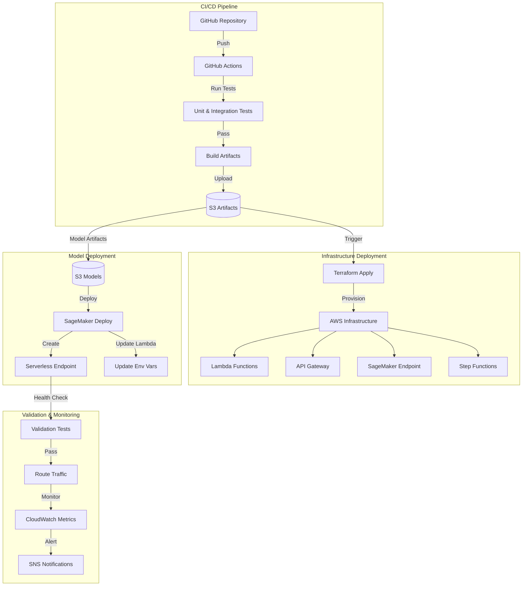
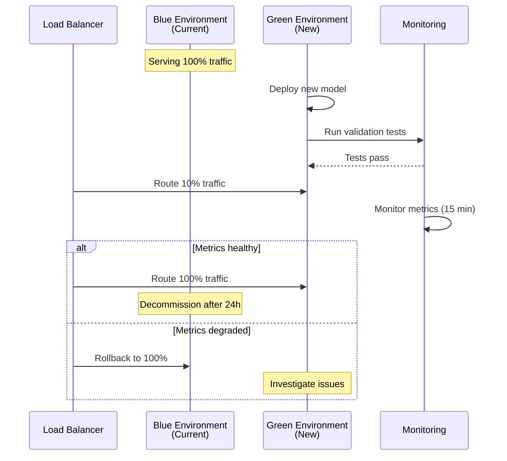
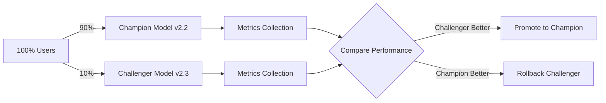
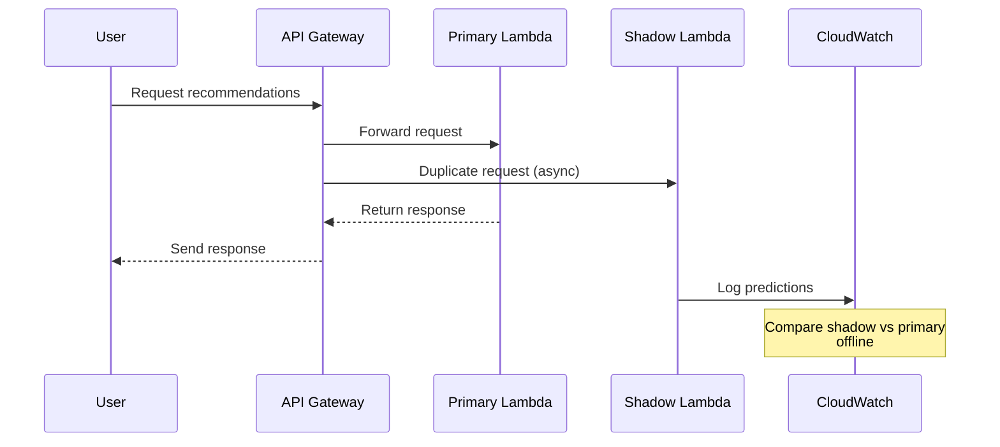

# Deployment Guide

## Overview
This document describes the deployment process for the ML recommendation system, including infrastructure provisioning, model deployment strategies, API configuration, and rollback procedures.

## Deployment Architecture



## Deployment Environments

### Environment Strategy
The system uses three environments with progressive deployment:

| Environment | Purpose | Traffic | Auto-Deploy |
|-------------|---------|---------|-------------|
| **Development** | Feature development and testing | Internal only | Yes (on merge to `develop`) |
| **Staging** | Pre-production validation | QA team + 5% real traffic | Yes (on merge to `main`) |
| **Production** | Live customer traffic | 95% real traffic | Manual approval required |

### Environment Configuration
Each environment has isolated resources defined in `terraform/environments/{env}/`:

```hcl
# terraform/environments/prod/main.tf
module "recommendation_system" {
  source = "../../modules"
  
  environment = "prod"
  
  # API Gateway
  api_throttle_rate_limit  = 10000
  api_throttle_burst_limit = 5000
  
  # Lambda
  lambda_memory_size       = 1024
  lambda_timeout           = 30
  lambda_reserved_concurrency = 100
  
  # SageMaker
  sagemaker_instance_type  = "ml.m5.xlarge"
  sagemaker_min_capacity   = 0
  sagemaker_max_capacity   = 10
  
  # Monitoring
  enable_xray              = true
  log_retention_days       = 90
  
  tags = {
    Environment = "production"
    Project     = "ml-recommendation"
    ManagedBy   = "terraform"
  }
}
```

## Deployment Strategies

### 1. Blue-Green Deployment
**Use Case**: Major model updates with architecture changes



**Implementation**:
```bash
# Deploy green environment
terraform apply -var="environment=prod-green"

# Validate green environment
python scripts/validate_deployment.py --environment prod-green

# Switch traffic gradually
aws apigatewayv2 update-stage \
  --api-id $API_ID \
  --stage-name prod \
  --deployment-id $GREEN_DEPLOYMENT_ID

# Monitor for 15 minutes, then complete or rollback
```

### 2. Canary Deployment
**Use Case**: Incremental model improvements



**Traffic Split Configuration**:
```python
# src/deployment/ab_testing.py
TRAFFIC_SPLIT = {
    "champion": {
        "model_version": "v2.2.0",
        "weight": 90
    },
    "challenger": {
        "model_version": "v2.3.0",
        "weight": 10
    }
}

def route_request(user_id):
    """Route request to champion or challenger based on user_id hash"""
    hash_value = hash(user_id) % 100
    if hash_value < TRAFFIC_SPLIT["challenger"]["weight"]:
        return TRAFFIC_SPLIT["challenger"]["model_version"]
    return TRAFFIC_SPLIT["champion"]["model_version"]
```

### 3. Shadow Deployment
**Use Case**: Testing new models without affecting users



**Implementation**:
```python
# Lambda handler with shadow mode
def lambda_handler(event, context):
    # Primary prediction
    primary_result = get_recommendations_v2_2(event)
    
    # Shadow prediction (async, non-blocking)
    if os.environ.get('SHADOW_MODE_ENABLED') == 'true':
        asyncio.create_task(
            shadow_predict(event, model_version='v2.3.0')
        )
    
    return primary_result

async def shadow_predict(event, model_version):
    """Run shadow prediction and log results"""
    shadow_result = get_recommendations(event, model_version)
    log_shadow_prediction(event, shadow_result, model_version)
```

## Infrastructure as Code (Terraform)

### Module Structure
```
terraform/
├── modules/
│   ├── sagemaker/           # SageMaker training & endpoints
│   ├── lambda-inference/    # Lambda functions
│   ├── api-gateway/         # API Gateway HTTP API
│   ├── model-registry/      # DynamoDB model registry
│   ├── ml-pipeline/         # Step Functions workflows
│   ├── monitoring/          # CloudWatch dashboards & alarms
│   └── s3-storage/          # S3 buckets
├── environments/
│   ├── dev/
│   ├── staging/
│   └── prod/
├── backend.tf               # Terraform state backend
└── provider.tf              # AWS provider configuration
```

### Deploying Infrastructure

#### Initial Setup
```bash
# Configure AWS credentials
export AWS_PROFILE=ml-recommendation-prod

# Initialize Terraform
cd terraform/environments/prod
terraform init

# Review plan
terraform plan -out=tfplan

# Apply changes
terraform apply tfplan
```

#### Updating Infrastructure
```bash
# Make changes to .tf files
vim terraform/modules/lambda-inference/main.tf

# Format and validate
terraform fmt -recursive
terraform validate

# Plan and apply
terraform plan -out=tfplan
terraform apply tfplan
```

### State Management
**Backend Configuration** (`terraform/backend.tf`):
```hcl
terraform {
  backend "s3" {
    bucket         = "ml-recommendation-terraform-state"
    key            = "prod/terraform.tfstate"
    region         = "us-east-1"
    encrypt        = true
    dynamodb_table = "terraform-state-lock"
  }
}
```

## Model Deployment Process

### Step-by-Step Deployment

#### 1. Train and Validate Model
```bash
# Trigger training via Step Functions
aws stepfunctions start-execution \
  --state-machine-arn arn:aws:states:us-east-1:123456789012:stateMachine:ModelTrainingPipeline \
  --input '{"data_start_date": "2024-01-01", "data_end_date": "2024-01-31"}'

# Monitor execution
aws stepfunctions describe-execution \
  --execution-arn $EXECUTION_ARN
```

#### 2. Register Model
```python
# Automatic registration after successful training
# src/training/train.py saves to DynamoDB ModelRegistry

{
  "model_id": "rec-model-v2.3.0",
  "status": "candidate",
  "metrics": {"ndcg@10": 0.52},
  "s3_path": "s3://model-artifacts/v2.3.0/"
}
```

#### 3. Deploy to Staging
```bash
# Deploy via GitHub Actions or manually
python scripts/deploy_model.py \
  --model-version v2.3.0 \
  --environment staging \
  --deployment-strategy canary \
  --traffic-percentage 10
```

#### 4. Validate Deployment
```bash
# Run integration tests
pytest tests/integration/test_deployment.py \
  --environment staging \
  --model-version v2.3.0

# Run load tests
locust -f tests/load/locustfile.py \
  --host https://api-staging.example.com \
  --users 100 \
  --spawn-rate 10
```

#### 5. Promote to Production
```bash
# After validation, promote to production
python scripts/deploy_model.py \
  --model-version v2.3.0 \
  --environment prod \
  --deployment-strategy canary \
  --traffic-percentage 10 \
  --approval-required

# Gradually increase traffic
python scripts/update_traffic_split.py \
  --model-version v2.3.0 \
  --traffic-percentage 50

# Full rollout after monitoring
python scripts/update_traffic_split.py \
  --model-version v2.3.0 \
  --traffic-percentage 100
```

## API Gateway Configuration

### HTTP API Setup
```hcl
# terraform/modules/api-gateway/main.tf
resource "aws_apigatewayv2_api" "recommendation_api" {
  name          = "recommendation-api-${var.environment}"
  protocol_type = "HTTP"
  
  cors_configuration {
    allow_origins = var.allowed_origins
    allow_methods = ["POST", "GET", "OPTIONS"]
    allow_headers = ["Content-Type", "Authorization"]
    max_age       = 300
  }
}

resource "aws_apigatewayv2_stage" "default" {
  api_id      = aws_apigatewayv2_api.recommendation_api.id
  name        = var.environment
  auto_deploy = true
  
  default_route_settings {
    throttling_rate_limit  = var.throttle_rate_limit
    throttling_burst_limit = var.throttle_burst_limit
  }
  
  access_log_settings {
    destination_arn = aws_cloudwatch_log_group.api_logs.arn
    format = jsonencode({
      requestId      = "$context.requestId"
      ip             = "$context.identity.sourceIp"
      requestTime    = "$context.requestTime"
      httpMethod     = "$context.httpMethod"
      routeKey       = "$context.routeKey"
      status         = "$context.status"
      protocol       = "$context.protocol"
      responseLength = "$context.responseLength"
    })
  }
}
```

### API Routes
| Route | Method | Lambda Function | Description |
|-------|--------|-----------------|-------------|
| `/recommend` | POST | `inference-handler` | Get personalized recommendations |
| `/health` | GET | `health-check` | API health status |
| `/metrics` | GET | `metrics-handler` | Model performance metrics |
| `/feedback` | POST | `feedback-handler` | Submit user feedback |

### Authentication
**API Key Authentication**:
```hcl
resource "aws_apigatewayv2_authorizer" "api_key" {
  api_id           = aws_apigatewayv2_api.recommendation_api.id
  authorizer_type  = "REQUEST"
  authorizer_uri   = aws_lambda_function.authorizer.invoke_arn
  identity_sources = ["$request.header.X-API-Key"]
  name             = "api-key-authorizer"
}
```

## Lambda Deployment

### Deployment Package
```bash
# Build deployment package
cd src/api
pip install -r requirements.txt -t package/
cp lambda_handler.py package/
cd package
zip -r ../lambda-deployment.zip .

# Upload to S3
aws s3 cp lambda-deployment.zip s3://deployment-artifacts/lambda/v2.3.0/
```

### Lambda Configuration
```hcl
resource "aws_lambda_function" "inference_handler" {
  function_name = "recommendation-inference-${var.environment}"
  role          = aws_iam_role.lambda_role.arn
  
  s3_bucket = var.deployment_bucket
  s3_key    = "lambda/v${var.lambda_version}/lambda-deployment.zip"
  
  handler = "lambda_handler.lambda_handler"
  runtime = "python3.11"
  timeout = 30
  memory_size = 1024
  
  reserved_concurrent_executions = var.reserved_concurrency
  
  environment {
    variables = {
      MODEL_BUCKET       = var.model_bucket
      MODEL_VERSION      = var.model_version
      SAGEMAKER_ENDPOINT = aws_sagemaker_endpoint.recommendation.name
      LOG_LEVEL          = "INFO"
    }
  }
  
  tracing_config {
    mode = "Active"  # Enable X-Ray
  }
  
  vpc_config {
    subnet_ids         = var.subnet_ids
    security_group_ids = var.security_group_ids
  }
}
```

### Lambda Layers
```hcl
resource "aws_lambda_layer_version" "ml_dependencies" {
  layer_name          = "ml-dependencies"
  compatible_runtimes = ["python3.11"]
  s3_bucket           = var.deployment_bucket
  s3_key              = "layers/ml-dependencies-v1.0.0.zip"
  
  description = "PyTorch, scikit-learn, and ML dependencies"
}
```

## SageMaker Endpoint Deployment

### Serverless Endpoint Configuration
```python
# src/deployment/sagemaker_deploy.py
from sagemaker.serverless import ServerlessInferenceConfig
from sagemaker.pytorch import PyTorchModel

def deploy_serverless_endpoint(model_version, environment):
    """Deploy model to SageMaker Serverless Inference"""
    
    model = PyTorchModel(
        model_data=f"s3://model-artifacts/{model_version}/model.tar.gz",
        role=get_sagemaker_role(),
        framework_version="2.0",
        py_version="py311",
        entry_point="inference.py",
        source_dir="src/inference"
    )
    
    serverless_config = ServerlessInferenceConfig(
        memory_size_in_mb=4096,
        max_concurrency=20
    )
    
    predictor = model.deploy(
        serverless_inference_config=serverless_config,
        endpoint_name=f"recommendation-{environment}-{model_version}"
    )
    
    return predictor
```

### Endpoint Monitoring
```hcl
resource "aws_cloudwatch_metric_alarm" "endpoint_invocation_errors" {
  alarm_name          = "sagemaker-endpoint-errors-${var.environment}"
  comparison_operator = "GreaterThanThreshold"
  evaluation_periods  = 2
  metric_name         = "ModelInvocationErrors"
  namespace           = "AWS/SageMaker"
  period              = 60
  statistic           = "Sum"
  threshold           = 10
  
  dimensions = {
    EndpointName = aws_sagemaker_endpoint.recommendation.name
  }
  
  alarm_actions = [aws_sns_topic.alerts.arn]
}
```

## Rollback Procedures

### Automatic Rollback Triggers
- API error rate > 5% for 5 minutes
- Average latency > 1000ms for 5 minutes
- SageMaker endpoint invocation errors > 10/minute
- Lambda throttling rate > 10%

### Manual Rollback
```bash
# Rollback to previous model version
python scripts/rollback_deployment.py \
  --environment prod \
  --target-version v2.2.0 \
  --reason "High error rate in v2.3.0"

# This will:
# 1. Update Lambda environment variables
# 2. Switch API Gateway to previous deployment
# 3. Update traffic routing
# 4. Send notifications
```

### Rollback Script
```python
# scripts/rollback_deployment.py
def rollback_deployment(environment, target_version, reason):
    """Rollback to previous model version"""
    
    # 1. Get previous deployment configuration
    previous_config = get_deployment_config(target_version)
    
    # 2. Update Lambda environment variables
    update_lambda_env_vars(
        function_name=f"recommendation-inference-{environment}",
        env_vars={"MODEL_VERSION": target_version}
    )
    
    # 3. Update traffic routing
    update_traffic_split(
        environment=environment,
        champion_version=target_version,
        champion_weight=100
    )
    
    # 4. Update model registry
    update_model_status(target_version, "champion")
    update_model_status(current_version, "rolled_back")
    
    # 5. Send notifications
    send_notification(
        subject=f"Deployment Rollback: {environment}",
        message=f"Rolled back to {target_version}. Reason: {reason}"
    )
    
    logger.info(f"Rollback completed: {environment} -> {target_version}")
```

## Deployment Checklist

### Pre-Deployment
- [ ] All tests passing (unit, integration, load)
- [ ] Model metrics meet acceptance criteria
- [ ] Security scan completed (no critical vulnerabilities)
- [ ] Documentation updated
- [ ] Rollback plan documented
- [ ] Stakeholders notified

### During Deployment
- [ ] Monitor CloudWatch metrics in real-time
- [ ] Check error logs for anomalies
- [ ] Validate API responses
- [ ] Monitor latency percentiles (p50, p95, p99)
- [ ] Check resource utilization (Lambda, SageMaker)

### Post-Deployment
- [ ] Verify traffic routing
- [ ] Run smoke tests
- [ ] Monitor for 1 hour minimum
- [ ] Compare A/B test metrics
- [ ] Update deployment log
- [ ] Archive deployment artifacts

## CI/CD Pipeline

### GitHub Actions Workflow
```yaml
# .github/workflows/model-deployment.yml
name: Model Deployment

on:
  workflow_dispatch:
    inputs:
      model_version:
        description: 'Model version to deploy'
        required: true
      environment:
        description: 'Target environment'
        required: true
        type: choice
        options:
          - dev
          - staging
          - prod
      traffic_percentage:
        description: 'Initial traffic percentage'
        required: true
        default: '10'

jobs:
  deploy:
    runs-on: ubuntu-latest
    environment: ${{ github.event.inputs.environment }}
    
    steps:
      - uses: actions/checkout@v3
      
      - name: Configure AWS credentials
        uses: aws-actions/configure-aws-credentials@v2
        with:
          role-to-assume: ${{ secrets.AWS_ROLE_ARN }}
          aws-region: us-east-1
      
      - name: Validate model artifacts
        run: |
          python scripts/validate_model.py \
            --model-version ${{ github.event.inputs.model_version }}
      
      - name: Deploy model
        run: |
          python scripts/deploy_model.py \
            --model-version ${{ github.event.inputs.model_version }} \
            --environment ${{ github.event.inputs.environment }} \
            --traffic-percentage ${{ github.event.inputs.traffic_percentage }}
      
      - name: Run integration tests
        run: |
          pytest tests/integration/ \
            --environment ${{ github.event.inputs.environment }}
      
      - name: Monitor deployment
        run: |
          python scripts/monitor_deployment.py \
            --duration 900 \
            --environment ${{ github.event.inputs.environment }}
```

## Best Practices

1. **Gradual Rollout**: Always start with <20% traffic for new models
2. **Monitoring**: Monitor for at least 1 hour before increasing traffic
3. **Automated Testing**: Run comprehensive tests before production deployment
4. **Rollback Plan**: Always have a tested rollback procedure
5. **Documentation**: Document all deployment decisions and outcomes
6. **Communication**: Notify stakeholders before and after deployments
7. **Versioning**: Use semantic versioning for all artifacts
8. **Immutability**: Never modify deployed artifacts; always deploy new versions
