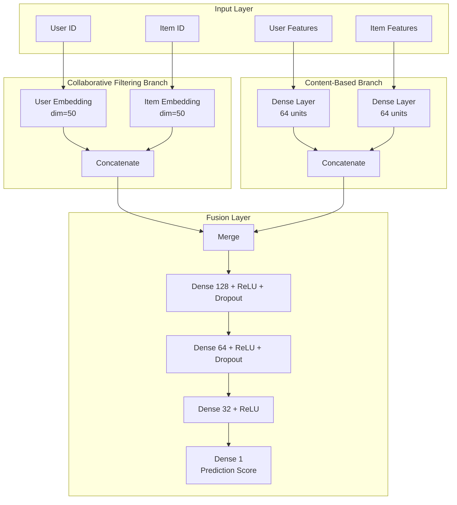
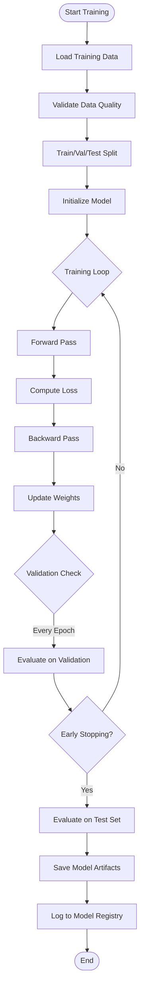

# Model Development Guide

## Overview
This document describes the machine learning models used in the recommendation system, including architecture, training procedures, hyperparameter tuning, and evaluation metrics.

## Model Architecture

### Hybrid Recommendation System
The system combines **Collaborative Filtering** and **Content-Based Filtering** to leverage both user behavior patterns and item characteristics.



### Model Components

#### 1. Neural Collaborative Filtering (NCF)
**Purpose**: Capture latent user-item interaction patterns

**Architecture**:
```python
class NeuralCollaborativeFiltering(nn.Module):
    def __init__(self, num_users, num_items, embedding_dim=50):
        super().__init__()
        self.user_embedding = nn.Embedding(num_users, embedding_dim)
        self.item_embedding = nn.Embedding(num_items, embedding_dim)
        
        self.mlp = nn.Sequential(
            nn.Linear(embedding_dim * 2, 128),
            nn.ReLU(),
            nn.Dropout(0.2),
            nn.Linear(128, 64),
            nn.ReLU(),
            nn.Dropout(0.2),
            nn.Linear(64, 32),
            nn.ReLU(),
            nn.Linear(32, 1)
        )
    
    def forward(self, user_ids, item_ids):
        user_emb = self.user_embedding(user_ids)
        item_emb = self.item_embedding(item_ids)
        x = torch.cat([user_emb, item_emb], dim=1)
        return self.mlp(x).squeeze()
```

**Key Parameters**:
- Embedding dimension: 50
- Hidden layers: [128, 64, 32]
- Dropout rate: 0.2
- Activation: ReLU

#### 2. Content-Based Features
**Purpose**: Incorporate product and user metadata

**User Features** (8 dimensions):
- Age group (one-hot encoded, 5 categories)
- Location (one-hot encoded, 3 categories)
- Customer segment (one-hot encoded, 3 categories)
- Total purchases (normalized)
- Average price point (normalized)
- Favorite category (embedding, dim=10)
- Recency score (0-1)
- Frequency score (0-1)

**Item Features** (10 dimensions):
- Category (embedding, dim=10)
- Price percentile (0-1)
- Popularity score (normalized)
- Average rating (0-1)
- Conversion rate (0-1)
- Trending score (normalized)
- Brand (embedding, dim=10)
- Recency score (0-1)

#### 3. Baseline Models
For comparison and fallback scenarios:

**Popularity-Based**:
- Recommends top-N most popular items globally
- Popularity = weighted combination of views, purchases, and ratings

**Category-Based**:
- Recommends popular items from user's favorite categories
- Uses historical category preferences

**Random**:
- Random recommendations (control baseline)

## Training Pipeline

### Training Workflow



### Training Configuration

**Default Hyperparameters**:
```yaml
model:
  embedding_dim: 50
  hidden_layers: [128, 64, 32]
  dropout_rate: 0.2

training:
  learning_rate: 0.001
  batch_size: 256
  num_epochs: 50
  optimizer: Adam
  loss_function: MSELoss
  early_stopping_patience: 5

data:
  train_ratio: 0.70
  val_ratio: 0.10
  test_ratio: 0.20
  negative_sampling_ratio: 4  # 4 negative samples per positive
```

### Loss Function
**Mean Squared Error (MSE)** for implicit feedback:
```
L = (1/N) * Σ(y_pred - y_true)²
```

Where:
- `y_true`: Implicit feedback score (0 for negative samples, 1 for positive)
- `y_pred`: Model prediction (0-1 range after sigmoid)

### Optimization
**Adam Optimizer**:
- Learning rate: 0.001
- Beta1: 0.9
- Beta2: 0.999
- Weight decay: 1e-5

**Learning Rate Scheduler**:
- ReduceLROnPlateau
- Factor: 0.5
- Patience: 3 epochs
- Min LR: 1e-6

## Hyperparameter Tuning

### Tuning Strategy
**Bayesian Optimization** using Amazon SageMaker Automatic Model Tuning

**Search Space**:
```python
hyperparameter_ranges = {
    'embedding_dim': IntegerParameter(32, 128),
    'learning_rate': ContinuousParameter(0.0001, 0.01, scaling_type='Logarithmic'),
    'batch_size': CategoricalParameter([128, 256, 512]),
    'dropout_rate': ContinuousParameter(0.1, 0.5),
    'hidden_layer_1': IntegerParameter(64, 256),
    'hidden_layer_2': IntegerParameter(32, 128),
    'hidden_layer_3': IntegerParameter(16, 64)
}
```

**Objective Metric**: Validation NDCG@10 (maximize)

**Tuning Job Configuration**:
- Max jobs: 20
- Max parallel jobs: 2
- Strategy: Bayesian
- Early stopping: Enabled

### Running Hyperparameter Tuning
```bash
python src/training/hyperparameter_tuning.py \
  --max-jobs 20 \
  --max-parallel-jobs 2 \
  --objective-metric "validation:ndcg@10" \
  --objective-type Maximize
```

## Model Evaluation

### Offline Metrics

#### 1. Ranking Metrics
**Precision@K**: Proportion of relevant items in top-K recommendations
```
Precision@K = (# relevant items in top-K) / K
```

**Recall@K**: Proportion of all relevant items found in top-K
```
Recall@K = (# relevant items in top-K) / (total # relevant items)
```

**NDCG@K**: Normalized Discounted Cumulative Gain
```
DCG@K = Σ(rel_i / log2(i + 1))  for i=1 to K
NDCG@K = DCG@K / IDCG@K
```

**Mean Average Precision (MAP)**:
```
MAP = (1/|U|) * Σ(AP(u))  for all users u
```

#### 2. Prediction Metrics
**RMSE**: Root Mean Squared Error
```
RMSE = sqrt((1/N) * Σ(y_pred - y_true)²)
```

**MAE**: Mean Absolute Error
```
MAE = (1/N) * Σ|y_pred - y_true|
```

#### 3. Business Metrics
- **Coverage**: Percentage of catalog recommended
- **Diversity**: Average pairwise dissimilarity of recommendations
- **Novelty**: Average popularity rank of recommendations (lower = more novel)
- **Serendipity**: Unexpected but relevant recommendations

#### 4. Fairness Metrics
**Demographic Parity**: Recommendation rate equality across user groups
```
DP = |P(R|G=A) - P(R|G=B)|
```

**Equal Opportunity**: True positive rate equality
```
EO = |TPR(G=A) - TPR(G=B)|
```

### Evaluation Results Format
```json
{
  "model_version": "v2.3.1",
  "timestamp": "2024-01-15T10:30:00Z",
  "metrics": {
    "ranking": {
      "precision@5": 0.42,
      "precision@10": 0.38,
      "recall@5": 0.15,
      "recall@10": 0.28,
      "ndcg@5": 0.51,
      "ndcg@10": 0.48,
      "map": 0.35
    },
    "prediction": {
      "rmse": 0.82,
      "mae": 0.65
    },
    "business": {
      "coverage": 0.73,
      "diversity": 0.68,
      "novelty": 0.42,
      "serendipity": 0.31
    },
    "fairness": {
      "demographic_parity": 0.08,
      "equal_opportunity": 0.12
    }
  },
  "comparison_to_baseline": {
    "ndcg@10_improvement": "+12.5%",
    "precision@10_improvement": "+8.3%"
  }
}
```

## Model Versioning

### Versioning Strategy
**Semantic Versioning**: `v{MAJOR}.{MINOR}.{PATCH}`
- **MAJOR**: Breaking changes (e.g., architecture change)
- **MINOR**: New features (e.g., additional input features)
- **PATCH**: Bug fixes or minor improvements

### Model Registry Schema
Stored in DynamoDB `ModelRegistry` table:

```json
{
  "model_id": "rec-model-v2.3.1",
  "version": "v2.3.1",
  "created_at": "2024-01-15T10:30:00Z",
  "status": "champion",
  "s3_path": "s3://model-artifacts/v2.3.1/",
  "hyperparameters": {
    "embedding_dim": 50,
    "learning_rate": 0.001,
    "batch_size": 256
  },
  "metrics": {
    "ndcg@10": 0.48,
    "precision@10": 0.38
  },
  "training_data": {
    "start_date": "2023-01-01",
    "end_date": "2024-01-01",
    "num_samples": 1500000
  },
  "deployment_history": [
    {
      "environment": "production",
      "deployed_at": "2024-01-16T08:00:00Z",
      "traffic_percentage": 100
    }
  ]
}
```

## Experiment Tracking

### MLflow Integration
Track experiments using MLflow (stored in DynamoDB):

```python
import mlflow

mlflow.set_experiment("recommendation-model")

with mlflow.start_run(run_name="ncf-experiment-1"):
    # Log parameters
    mlflow.log_param("embedding_dim", 50)
    mlflow.log_param("learning_rate", 0.001)
    
    # Log metrics
    mlflow.log_metric("train_loss", 0.45)
    mlflow.log_metric("val_ndcg@10", 0.48)
    
    # Log model
    mlflow.pytorch.log_model(model, "model")
    
    # Log artifacts
    mlflow.log_artifact("metrics.json")
```

## Model Artifacts

### Saved Artifacts Structure
```
s3://model-artifacts/v2.3.1/
├── model.pth                 # PyTorch model weights
├── user_id_map.pkl          # User ID to index mapping
├── item_id_map.pkl          # Item ID to index mapping
├── config.json              # Model configuration
├── metrics.json             # Evaluation metrics
├── training_history.json    # Training loss/metrics per epoch
└── feature_stats.json       # Feature normalization statistics
```

## Best Practices

### 1. Data Preparation
- ✅ Use temporal splits to avoid data leakage
- ✅ Balance positive/negative samples (1:4 ratio)
- ✅ Normalize continuous features to [0, 1]
- ✅ Handle cold-start users/items separately

### 2. Training
- ✅ Monitor both training and validation metrics
- ✅ Use early stopping to prevent overfitting
- ✅ Save checkpoints every epoch
- ✅ Log all hyperparameters and random seeds for reproducibility

### 3. Evaluation
- ✅ Evaluate on multiple metrics (ranking + business)
- ✅ Compare against baseline models
- ✅ Test on different user segments (new vs. active)
- ✅ Perform A/B testing before full deployment

### 4. Deployment
- ✅ Version all models semantically
- ✅ Maintain champion/challenger framework
- ✅ Implement gradual rollout (canary deployment)
- ✅ Monitor online metrics (CTR, conversion)

## Troubleshooting

### Common Issues

**Issue**: Model overfits (high train accuracy, low validation)
- **Solution**: Increase dropout rate, reduce model complexity, or add L2 regularization

**Issue**: Poor performance on cold-start users
- **Solution**: Implement content-based fallback or popularity-based recommendations

**Issue**: Training is slow
- **Solution**: Increase batch size, use mixed precision training, or reduce embedding dimensions

**Issue**: Recommendations lack diversity
- **Solution**: Add diversity penalty in ranking, or use MMR (Maximal Marginal Relevance)

## Future Enhancements

1. **Multi-Task Learning**: Jointly predict clicks, purchases, and ratings
2. **Contextual Bandits**: Incorporate real-time feedback for exploration
3. **Graph Neural Networks**: Model user-item-category relationships
4. **Transformer-Based Models**: Use attention mechanisms for sequential recommendations
5. **Federated Learning**: Train on decentralized user data for privacy
