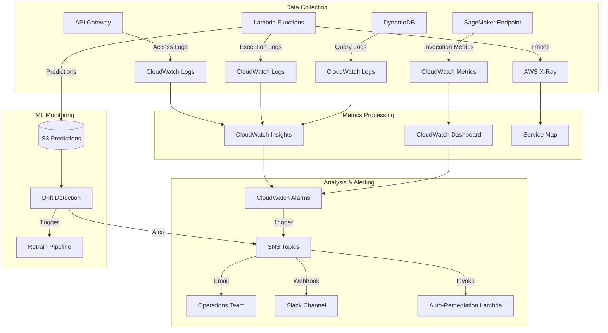

# Monitoring & Operations Guide

## Overview
This document describes the monitoring, alerting, and operational procedures for the ML recommendation system. It covers performance monitoring, model drift detection, incident response, and system maintenance.

## Monitoring Architecture



## Key Performance Indicators (KPIs)

### 1. System Performance Metrics

#### API Metrics
| Metric | Target | Warning Threshold | Critical Threshold |
|--------|--------|-------------------|-------------------|
| **Latency (p50)** | <100ms | >150ms | >200ms |
| **Latency (p95)** | <250ms | >400ms | >500ms |
| **Latency (p99)** | <500ms | >800ms | >1000ms |
| **Error Rate** | <0.1% | >1% | >5% |
| **Availability** | >99.9% | <99.5% | <99% |
| **Throughput** | 1000 req/s | N/A | N/A |

#### Lambda Metrics
| Metric | Target | Warning Threshold | Critical Threshold |
|--------|--------|-------------------|-------------------|
| **Duration (avg)** | <200ms | >500ms | >1000ms |
| **Error Rate** | <0.1% | >1% | >5% |
| **Throttles** | 0 | >10/min | >50/min |
| **Concurrent Executions** | <80% of limit | >90% | >95% |
| **Memory Usage** | <70% | >85% | >95% |

#### SageMaker Endpoint Metrics
| Metric | Target | Warning Threshold | Critical Threshold |
|--------|--------|-------------------|-------------------|
| **Model Latency** | <50ms | >100ms | >200ms |
| **Invocation Errors** | 0 | >5/min | >20/min |
| **CPU Utilization** | <60% | >80% | >90% |
| **Memory Utilization** | <70% | >85% | >95% |

### 2. ML Model Metrics

#### Online Metrics (Real-time)
| Metric | Target | Warning Threshold | Critical Threshold |
|--------|--------|-------------------|-------------------|
| **Click-Through Rate (CTR)** | >3% | <2.5% | <2% |
| **Conversion Rate** | >1.5% | <1.2% | <1% |
| **Average Order Value** | >$75 | <$60 | <$50 |
| **Recommendation Coverage** | >70% | <60% | <50% |
| **Diversity Score** | >0.6 | <0.5 | <0.4 |

#### Offline Metrics (Batch Evaluation)
| Metric | Target | Warning Threshold |
|--------|--------|-------------------|
| **NDCG@10** | >0.45 | <0.40 |
| **Precision@10** | >0.35 | <0.30 |
| **Recall@10** | >0.25 | <0.20 |
| **Model Drift Score** | <0.1 | >0.2 |

### 3. Business Metrics
| Metric | Target | Measurement Frequency |
|--------|--------|----------------------|
| **Revenue from Recommendations** | Track trend | Daily |
| **User Engagement** | Track trend | Daily |
| **Cart Abandonment Rate** | <30% | Daily |
| **Return Customer Rate** | >40% | Weekly |

## CloudWatch Dashboards

### Main Operations Dashboard
```json
{
  "widgets": [
    {
      "type": "metric",
      "properties": {
        "title": "API Latency (p50, p95, p99)",
        "metrics": [
          ["AWS/ApiGateway", "Latency", {"stat": "p50"}],
          ["...", {"stat": "p95"}],
          ["...", {"stat": "p99"}]
        ],
        "period": 60,
        "region": "us-east-1"
      }
    },
    {
      "type": "metric",
      "properties": {
        "title": "Request Count & Error Rate",
        "metrics": [
          ["AWS/ApiGateway", "Count", {"stat": "Sum", "yAxis": "left"}],
          [".", "4XXError", {"stat": "Sum", "yAxis": "right"}],
          [".", "5XXError", {"stat": "Sum", "yAxis": "right"}]
        ],
        "period": 60
      }
    },
    {
      "type": "metric",
      "properties": {
        "title": "Lambda Performance",
        "metrics": [
          ["AWS/Lambda", "Duration", {"stat": "Average"}],
          [".", "Errors", {"stat": "Sum"}],
          [".", "Throttles", {"stat": "Sum"}],
          [".", "ConcurrentExecutions", {"stat": "Maximum"}]
        ],
        "period": 60
      }
    },
    {
      "type": "metric",
      "properties": {
        "title": "SageMaker Endpoint",
        "metrics": [
          ["AWS/SageMaker", "ModelLatency", {"stat": "Average"}],
          [".", "Invocations", {"stat": "Sum"}],
          [".", "ModelInvocationErrors", {"stat": "Sum"}]
        ],
        "period": 60
      }
    },
    {
      "type": "log",
      "properties": {
        "title": "Recent Errors",
        "query": "SOURCE '/aws/lambda/recommendation-inference'\n| fields @timestamp, @message\n| filter @message like /ERROR/\n| sort @timestamp desc\n| limit 20",
        "region": "us-east-1"
      }
    }
  ]
}
```

### ML Model Performance Dashboard
```json
{
  "widgets": [
    {
      "type": "metric",
      "properties": {
        "title": "Click-Through Rate (CTR)",
        "metrics": [
          ["RecommendationSystem", "CTR", {"stat": "Average"}]
        ],
        "period": 3600,
        "annotations": {
          "horizontal": [
            {"value": 3.0, "label": "Target", "color": "#2ca02c"},
            {"value": 2.5, "label": "Warning", "color": "#ff7f0e"}
          ]
        }
      }
    },
    {
      "type": "metric",
      "properties": {
        "title": "Conversion Rate",
        "metrics": [
          ["RecommendationSystem", "ConversionRate", {"stat": "Average"}]
        ],
        "period": 3600
      }
    },
    {
      "type": "metric",
      "properties": {
        "title": "Model Drift Score",
        "metrics": [
          ["RecommendationSystem", "FeatureDrift", {"stat": "Average"}],
          [".", "PredictionDrift", {"stat": "Average"}]
        ],
        "period": 3600
      }
    },
    {
      "type": "metric",
      "properties": {
        "title": "Recommendation Diversity",
        "metrics": [
          ["RecommendationSystem", "DiversityScore", {"stat": "Average"}],
          [".", "CoveragePercentage", {"stat": "Average"}]
        ],
        "period": 3600
      }
    }
  ]
}
```

## CloudWatch Alarms

### Critical Alarms

#### High Error Rate
```hcl
resource "aws_cloudwatch_metric_alarm" "high_error_rate" {
  alarm_name          = "recommendation-api-high-error-rate"
  comparison_operator = "GreaterThanThreshold"
  evaluation_periods  = 2
  metric_name         = "5XXError"
  namespace           = "AWS/ApiGateway"
  period              = 60
  statistic           = "Sum"
  threshold           = 10
  treat_missing_data  = "notBreaching"
  
  alarm_description = "API error rate exceeded 10 errors per minute"
  alarm_actions     = [aws_sns_topic.critical_alerts.arn]
  
  dimensions = {
    ApiId = aws_apigatewayv2_api.recommendation_api.id
  }
}
```

#### High Latency
```hcl
resource "aws_cloudwatch_metric_alarm" "high_latency" {
  alarm_name          = "recommendation-api-high-latency"
  comparison_operator = "GreaterThanThreshold"
  evaluation_periods  = 3
  metric_name         = "Latency"
  namespace           = "AWS/ApiGateway"
  period              = 60
  statistic           = "p99"
  threshold           = 1000
  
  alarm_description = "API p99 latency exceeded 1000ms"
  alarm_actions     = [aws_sns_topic.warning_alerts.arn]
}
```

#### Model Drift Detected
```hcl
resource "aws_cloudwatch_metric_alarm" "model_drift" {
  alarm_name          = "recommendation-model-drift-detected"
  comparison_operator = "GreaterThanThreshold"
  evaluation_periods  = 1
  metric_name         = "FeatureDrift"
  namespace           = "RecommendationSystem"
  period              = 3600
  statistic           = "Average"
  threshold           = 0.2
  
  alarm_description = "Model feature drift exceeded threshold"
  alarm_actions     = [
    aws_sns_topic.ml_alerts.arn,
    aws_lambda_function.trigger_retraining.arn
  ]
}
```

#### Low CTR
```hcl
resource "aws_cloudwatch_metric_alarm" "low_ctr" {
  alarm_name          = "recommendation-low-ctr"
  comparison_operator = "LessThanThreshold"
  evaluation_periods  = 3
  metric_name         = "CTR"
  namespace           = "RecommendationSystem"
  period              = 3600
  statistic           = "Average"
  threshold           = 2.0
  
  alarm_description = "Click-through rate below 2%"
  alarm_actions     = [aws_sns_topic.ml_alerts.arn]
}
```

## Drift Detection

### Feature Drift Monitoring
**Script**: `src/monitoring/drift_detector.py`

```python
import numpy as np
from scipy.stats import ks_2samp, chi2_contingency

class DriftDetector:
    """Detect distribution drift in features and predictions"""
    
    def __init__(self, reference_data, threshold=0.05):
        self.reference_data = reference_data
        self.threshold = threshold
    
    def detect_numerical_drift(self, current_data, feature_name):
        """Kolmogorov-Smirnov test for numerical features"""
        reference_values = self.reference_data[feature_name]
        current_values = current_data[feature_name]
        
        statistic, p_value = ks_2samp(reference_values, current_values)
        
        drift_detected = p_value < self.threshold
        
        return {
            'feature': feature_name,
            'drift_detected': drift_detected,
            'p_value': p_value,
            'statistic': statistic,
            'severity': self._calculate_severity(statistic)
        }
    
    def detect_categorical_drift(self, current_data, feature_name):
        """Chi-square test for categorical features"""
        reference_counts = self.reference_data[feature_name].value_counts()
        current_counts = current_data[feature_name].value_counts()
        
        # Align categories
        all_categories = set(reference_counts.index) | set(current_counts.index)
        reference_freq = [reference_counts.get(cat, 0) for cat in all_categories]
        current_freq = [current_counts.get(cat, 0) for cat in all_categories]
        
        statistic, p_value, _, _ = chi2_contingency([reference_freq, current_freq])
        
        drift_detected = p_value < self.threshold
        
        return {
            'feature': feature_name,
            'drift_detected': drift_detected,
            'p_value': p_value,
            'statistic': statistic
        }
    
    def detect_prediction_drift(self, current_predictions):
        """Detect drift in prediction distribution"""
        reference_predictions = self.reference_data['predictions']
        
        # Compare distributions
        statistic, p_value = ks_2samp(reference_predictions, current_predictions)
        
        # Compare mean and variance
        ref_mean, ref_std = reference_predictions.mean(), reference_predictions.std()
        cur_mean, cur_std = current_predictions.mean(), current_predictions.std()
        
        mean_shift = abs(cur_mean - ref_mean) / ref_std
        variance_change = abs(cur_std - ref_std) / ref_std
        
        return {
            'drift_detected': p_value < self.threshold or mean_shift > 2,
            'p_value': p_value,
            'mean_shift': mean_shift,
            'variance_change': variance_change
        }
    
    def _calculate_severity(self, statistic):
        """Calculate drift severity based on statistic"""
        if statistic < 0.1:
            return 'low'
        elif statistic < 0.3:
            return 'medium'
        else:
            return 'high'
```

### Automated Drift Monitoring
**Scheduled Lambda** (runs hourly):

```python
def lambda_handler(event, context):
    """Hourly drift detection"""
    
    # Load reference data (training data distribution)
    reference_data = load_reference_data()
    
    # Load recent predictions (last hour)
    current_data = load_recent_predictions(hours=1)
    
    detector = DriftDetector(reference_data)
    
    # Check all features
    drift_results = []
    for feature in MONITORED_FEATURES:
        if is_numerical(feature):
            result = detector.detect_numerical_drift(current_data, feature)
        else:
            result = detector.detect_categorical_drift(current_data, feature)
        
        drift_results.append(result)
        
        # Log to CloudWatch
        cloudwatch.put_metric_data(
            Namespace='RecommendationSystem',
            MetricData=[{
                'MetricName': f'FeatureDrift_{feature}',
                'Value': result['statistic'],
                'Unit': 'None'
            }]
        )
    
    # Check prediction drift
    pred_drift = detector.detect_prediction_drift(current_data['predictions'])
    
    # Alert if drift detected
    if any(r['drift_detected'] for r in drift_results) or pred_drift['drift_detected']:
        send_drift_alert(drift_results, pred_drift)
        
        # Trigger retraining if severe
        if pred_drift.get('mean_shift', 0) > 3:
            trigger_retraining_pipeline()
    
    return {'statusCode': 200, 'drift_results': drift_results}
```

## Data Quality Monitoring

### Automated Data Quality Checks
```python
# src/monitoring/data_quality_monitor.py

class DataQualityMonitor:
    """Monitor data quality metrics"""
    
    def check_completeness(self, data):
        """Check for missing values"""
        missing_percentages = data.isnull().mean()
        
        issues = []
        for column, pct in missing_percentages.items():
            if pct > 0.1:  # More than 10% missing
                issues.append({
                    'column': column,
                    'missing_percentage': pct,
                    'severity': 'high' if pct > 0.3 else 'medium'
                })
        
        return issues
    
    def check_validity(self, data):
        """Check for invalid values"""
        issues = []
        
        # Check price is positive
        if (data['price'] <= 0).any():
            issues.append({
                'check': 'price_validity',
                'message': 'Negative or zero prices detected'
            })
        
        # Check rating is in range [1, 5]
        if ((data['rating'] < 1) | (data['rating'] > 5)).any():
            issues.append({
                'check': 'rating_validity',
                'message': 'Ratings outside valid range'
            })
        
        return issues
    
    def check_freshness(self, data):
        """Check data recency"""
        latest_timestamp = data['timestamp'].max()
        age_hours = (datetime.now() - latest_timestamp).total_seconds() / 3600
        
        if age_hours > 6:
            return {
                'fresh': False,
                'age_hours': age_hours,
                'severity': 'critical' if age_hours > 24 else 'warning'
            }
        
        return {'fresh': True, 'age_hours': age_hours}
    
    def check_volume(self, data, expected_min_rows=1000):
        """Check data volume"""
        row_count = len(data)
        
        if row_count < expected_min_rows:
            return {
                'sufficient': False,
                'row_count': row_count,
                'expected_min': expected_min_rows
            }
        
        return {'sufficient': True, 'row_count': row_count}
```

## Logging Strategy

### Log Levels
- **DEBUG**: Detailed diagnostic information (disabled in production)
- **INFO**: General informational messages (e.g., request received, model loaded)
- **WARNING**: Warning messages (e.g., high latency, approaching limits)
- **ERROR**: Error messages (e.g., failed API call, model inference error)
- **CRITICAL**: Critical issues requiring immediate attention

### Structured Logging
```python
# src/utils/logging_utils.py
import json
import logging
from datetime import datetime

class StructuredLogger:
    """Structured JSON logging for CloudWatch"""
    
    def __init__(self, name):
        self.logger = logging.getLogger(name)
        self.logger.setLevel(logging.INFO)
    
    def log(self, level, message, **kwargs):
        """Log structured JSON message"""
        log_entry = {
            'timestamp': datetime.utcnow().isoformat(),
            'level': level,
            'message': message,
            **kwargs
        }
        
        self.logger.log(
            getattr(logging, level),
            json.dumps(log_entry)
        )
    
    def log_request(self, user_id, num_recommendations, latency_ms):
        """Log API request"""
        self.log('INFO', 'API request processed', 
                 user_id=user_id,
                 num_recommendations=num_recommendations,
                 latency_ms=latency_ms,
                 event_type='api_request')
    
    def log_error(self, error_type, error_message, **context):
        """Log error with context"""
        self.log('ERROR', error_message,
                 error_type=error_type,
                 event_type='error',
                 **context)
```

### CloudWatch Insights Queries

**Top Errors (Last Hour)**:
```
fields @timestamp, error_type, error_message
| filter event_type = "error"
| stats count() by error_type
| sort count desc
| limit 10
```

**Average Latency by User Segment**:
```
fields user_segment, latency_ms
| filter event_type = "api_request"
| stats avg(latency_ms) as avg_latency by user_segment
| sort avg_latency desc
```

**Model Version Performance**:
```
fields model_version, ctr, conversion_rate
| filter event_type = "recommendation_feedback"
| stats avg(ctr) as avg_ctr, avg(conversion_rate) as avg_conversion by model_version
```

## Incident Response

### Incident Severity Levels

| Level | Description | Response Time | Escalation |
|-------|-------------|---------------|------------|
| **P0 - Critical** | Complete service outage | <15 minutes | Immediate page on-call engineer |
| **P1 - High** | Degraded performance affecting >50% users | <30 minutes | Notify on-call engineer |
| **P2 - Medium** | Partial degradation affecting <50% users | <2 hours | Email engineering team |
| **P3 - Low** | Minor issues, no user impact | <24 hours | Create ticket |

### Incident Response Playbook

#### High Error Rate (P1)
**Symptoms**: API error rate >5% for 5 minutes

**Response Steps**:
1. **Investigate** (0-5 min):
   - Check CloudWatch dashboard for error patterns
   - Review recent deployments
   - Check AWS service health dashboard

2. **Mitigate** (5-15 min):
   - If recent deployment: Rollback to previous version
   - If SageMaker endpoint issue: Switch to fallback model
   - If Lambda issue: Increase concurrency or memory

3. **Resolve** (15-60 min):
   - Identify root cause
   - Apply permanent fix
   - Monitor for 30 minutes

4. **Post-Incident** (24 hours):
   - Write incident report
   - Update runbooks
   - Implement preventive measures

#### Model Performance Degradation (P2)
**Symptoms**: CTR drops >20% compared to baseline

**Response Steps**:
1. **Validate** (0-30 min):
   - Confirm metric drop is statistically significant
   - Check if affecting all user segments
   - Review recent model changes

2. **Investigate** (30-120 min):
   - Analyze prediction distribution
   - Check for data quality issues
   - Review feature drift metrics

3. **Mitigate** (2-4 hours):
   - Rollback to previous model if recent deployment
   - Trigger retraining pipeline
   - Adjust traffic split to champion model

4. **Monitor** (24-48 hours):
   - Track recovery of metrics
   - Validate new model performance

### Auto-Remediation

**Lambda Function** for automatic remediation:
```python
def auto_remediate(event, context):
    """Automatic remediation for common issues"""
    
    alarm_name = event['alarmData']['alarmName']
    
    if 'high-error-rate' in alarm_name:
        # Rollback to previous deployment
        rollback_deployment()
        send_notification("Auto-remediation: Rolled back deployment")
    
    elif 'high-latency' in alarm_name:
        # Increase Lambda memory
        increase_lambda_memory()
        send_notification("Auto-remediation: Increased Lambda memory")
    
    elif 'model-drift' in alarm_name:
        # Trigger retraining pipeline
        trigger_retraining()
        send_notification("Auto-remediation: Triggered model retraining")
    
    else:
        # Unknown issue, notify team
        send_notification(f"Manual intervention required: {alarm_name}")
```

## Operational Runbooks

### Daily Operations Checklist
- [ ] Review CloudWatch dashboards for anomalies
- [ ] Check error logs for new error patterns
- [ ] Verify data pipeline completed successfully
- [ ] Review model performance metrics (CTR, conversion)
- [ ] Check resource utilization (Lambda, SageMaker)
- [ ] Verify backup completion

### Weekly Operations Checklist
- [ ] Review weekly performance trends
- [ ] Analyze A/B test results
- [ ] Review and update alarms if needed
- [ ] Check for security updates
- [ ] Review cost optimization opportunities
- [ ] Update documentation

### Monthly Operations Checklist
- [ ] Conduct capacity planning review
- [ ] Review and update incident response playbooks
- [ ] Analyze long-term performance trends
- [ ] Review and optimize costs
- [ ] Conduct disaster recovery drill
- [ ] Update system documentation

## Cost Monitoring

### Cost Allocation Tags
```hcl
tags = {
  Project     = "ml-recommendation"
  Environment = "production"
  CostCenter  = "engineering"
  Owner       = "ml-team"
}
```

### Cost Optimization Strategies
1. **Lambda**: Use reserved concurrency to avoid over-provisioning
2. **SageMaker**: Use Serverless Inference for variable traffic
3. **S3**: Implement lifecycle policies to move old data to Glacier
4. **CloudWatch**: Adjust log retention periods based on compliance needs
5. **DynamoDB**: Use on-demand pricing for variable workloads

## Best Practices

1. **Proactive Monitoring**: Set up alerts before issues impact users
2. **Comprehensive Logging**: Log all important events with context
3. **Regular Reviews**: Review dashboards and metrics regularly
4. **Automated Remediation**: Automate common remediation tasks
5. **Documentation**: Keep runbooks and documentation up-to-date
6. **Testing**: Test monitoring and alerting regularly
7. **Continuous Improvement**: Learn from incidents and improve systems
