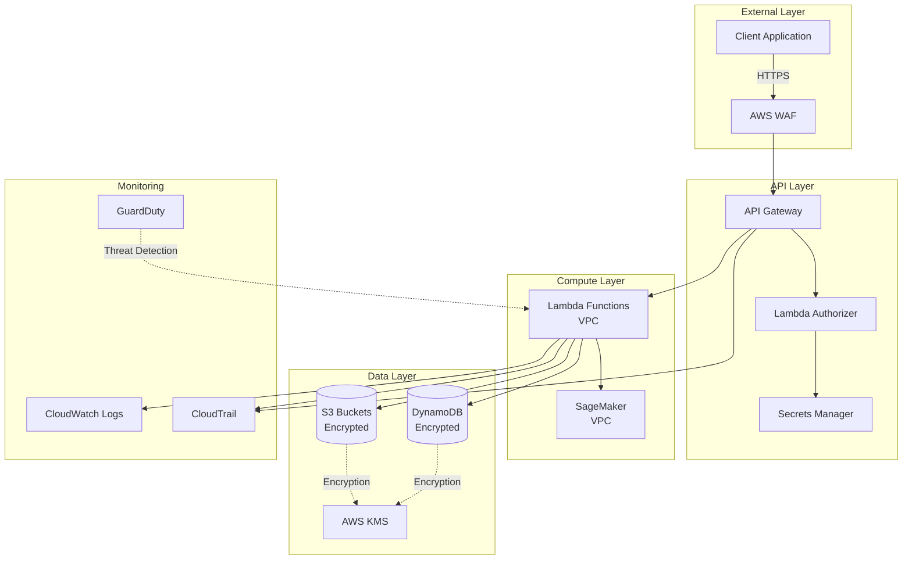

# Security & Compliance Guide

## Overview
This document outlines the security architecture, compliance requirements, and best practices for the ML recommendation system. It covers authentication, authorization, data protection, network security, and regulatory compliance.

## Security Architecture



## Authentication & Authorization

### API Key Management

**API Key Generation**:
```python
import secrets
import hashlib
from datetime import datetime, timedelta

def generate_api_key():
    """Generate secure API key"""
    # Generate random key
    key = secrets.token_urlsafe(32)
    
    # Hash for storage
    key_hash = hashlib.sha256(key.encode()).hexdigest()
    
    # Store in DynamoDB
    api_keys_table.put_item(Item={
        'key_hash': key_hash,
        'created_at': datetime.utcnow().isoformat(),
        'expires_at': (datetime.utcnow() + timedelta(days=365)).isoformat(),
        'rate_limit': 1000,
        'permissions': ['read:recommendations', 'write:feedback']
    })
    
    return key  # Return only once, never stored in plain text
```

**API Key Validation** (Lambda Authorizer):
```python
def lambda_authorizer(event, context):
    """Validate API key and return IAM policy"""
    
    api_key = event['headers'].get('x-api-key')
    
    if not api_key:
        raise Exception('Unauthorized')
    
    # Hash and lookup
    key_hash = hashlib.sha256(api_key.encode()).hexdigest()
    response = api_keys_table.get_item(Key={'key_hash': key_hash})
    
    if 'Item' not in response:
        raise Exception('Unauthorized')
    
    key_data = response['Item']
    
    # Check expiration
    if datetime.fromisoformat(key_data['expires_at']) < datetime.utcnow():
        raise Exception('Unauthorized')
    
    # Return IAM policy
    return {
        'principalId': key_hash,
        'policyDocument': {
            'Version': '2012-10-17',
            'Statement': [{
                'Action': 'execute-api:Invoke',
                'Effect': 'Allow',
                'Resource': event['methodArn']
            }]
        },
        'context': {
            'rate_limit': key_data['rate_limit'],
            'permissions': ','.join(key_data['permissions'])
        }
    }
```

### IAM Roles & Policies

**Lambda Execution Role**:
```hcl
resource "aws_iam_role" "lambda_execution" {
  name = "recommendation-lambda-execution"
  
  assume_role_policy = jsonencode({
    Version = "2012-10-17"
    Statement = [{
      Action = "sts:AssumeRole"
      Effect = "Allow"
      Principal = {
        Service = "lambda.amazonaws.com"
      }
    }]
  })
}

resource "aws_iam_role_policy" "lambda_policy" {
  name = "recommendation-lambda-policy"
  role = aws_iam_role.lambda_execution.id
  
  policy = jsonencode({
    Version = "2012-10-17"
    Statement = [
      {
        Effect = "Allow"
        Action = [
          "s3:GetObject"
        ]
        Resource = [
          "${aws_s3_bucket.models.arn}/*"
        ]
      },
      {
        Effect = "Allow"
        Action = [
          "dynamodb:GetItem",
          "dynamodb:Query"
        ]
        Resource = [
          aws_dynamodb_table.user_interactions.arn
        ]
      },
      {
        Effect = "Allow"
        Action = [
          "sagemaker:InvokeEndpoint"
        ]
        Resource = [
          aws_sagemaker_endpoint.recommendation.arn
        ]
      },
      {
        Effect = "Allow"
        Action = [
          "kms:Decrypt"
        ]
        Resource = [
          aws_kms_key.data_encryption.arn
        ]
      },
      {
        Effect = "Allow"
        Action = [
          "logs:CreateLogGroup",
          "logs:CreateLogStream",
          "logs:PutLogEvents"
        ]
        Resource = "arn:aws:logs:*:*:*"
      }
    ]
  })
}
```

**SageMaker Execution Role**:
```hcl
resource "aws_iam_role" "sagemaker_execution" {
  name = "recommendation-sagemaker-execution"
  
  assume_role_policy = jsonencode({
    Version = "2012-10-17"
    Statement = [{
      Action = "sts:AssumeRole"
      Effect = "Allow"
      Principal = {
        Service = "sagemaker.amazonaws.com"
      }
    }]
  })
}

resource "aws_iam_role_policy" "sagemaker_policy" {
  name = "recommendation-sagemaker-policy"
  role = aws_iam_role.sagemaker_execution.id
  
  policy = jsonencode({
    Version = "2012-10-17"
    Statement = [
      {
        Effect = "Allow"
        Action = [
          "s3:GetObject",
          "s3:PutObject"
        ]
        Resource = [
          "${aws_s3_bucket.training_data.arn}/*",
          "${aws_s3_bucket.models.arn}/*"
        ]
      },
      {
        Effect = "Allow"
        Action = [
          "ecr:GetAuthorizationToken",
          "ecr:BatchCheckLayerAvailability",
          "ecr:GetDownloadUrlForLayer",
          "ecr:BatchGetImage"
        ]
        Resource = "*"
      }
    ]
  })
}
```

## Data Protection

### Encryption at Rest

**S3 Bucket Encryption**:
```hcl
resource "aws_s3_bucket" "models" {
  bucket = "ml-recommendation-models-${var.environment}"
}

resource "aws_s3_bucket_server_side_encryption_configuration" "models" {
  bucket = aws_s3_bucket.models.id
  
  rule {
    apply_server_side_encryption_by_default {
      sse_algorithm     = "aws:kms"
      kms_master_key_id = aws_kms_key.data_encryption.arn
    }
    bucket_key_enabled = true
  }
}

resource "aws_s3_bucket_versioning" "models" {
  bucket = aws_s3_bucket.models.id
  
  versioning_configuration {
    status = "Enabled"
  }
}
```

**DynamoDB Encryption**:
```hcl
resource "aws_dynamodb_table" "user_interactions" {
  name           = "UserInteractions-${var.environment}"
  billing_mode   = "PAY_PER_REQUEST"
  hash_key       = "user_id"
  range_key      = "timestamp"
  
  server_side_encryption {
    enabled     = true
    kms_key_arn = aws_kms_key.data_encryption.arn
  }
  
  point_in_time_recovery {
    enabled = true
  }
  
  attribute {
    name = "user_id"
    type = "S"
  }
  
  attribute {
    name = "timestamp"
    type = "S"
  }
}
```

**KMS Key Configuration**:
```hcl
resource "aws_kms_key" "data_encryption" {
  description             = "Encryption key for ML recommendation system"
  deletion_window_in_days = 30
  enable_key_rotation     = true
  
  policy = jsonencode({
    Version = "2012-10-17"
    Statement = [
      {
        Sid    = "Enable IAM User Permissions"
        Effect = "Allow"
        Principal = {
          AWS = "arn:aws:iam::${data.aws_caller_identity.current.account_id}:root"
        }
        Action   = "kms:*"
        Resource = "*"
      },
      {
        Sid    = "Allow services to use the key"
        Effect = "Allow"
        Principal = {
          Service = [
            "s3.amazonaws.com",
            "dynamodb.amazonaws.com",
            "lambda.amazonaws.com",
            "sagemaker.amazonaws.com"
          ]
        }
        Action = [
          "kms:Decrypt",
          "kms:GenerateDataKey"
        ]
        Resource = "*"
      }
    ]
  })
}

resource "aws_kms_alias" "data_encryption" {
  name          = "alias/ml-recommendation-${var.environment}"
  target_key_id = aws_kms_key.data_encryption.key_id
}
```

### Encryption in Transit

**API Gateway TLS Configuration**:
```hcl
resource "aws_apigatewayv2_domain_name" "recommendation_api" {
  domain_name = "api.recommendation.example.com"
  
  domain_name_configuration {
    certificate_arn = aws_acm_certificate.api_cert.arn
    endpoint_type   = "REGIONAL"
    security_policy = "TLS_1_2"
  }
}

resource "aws_acm_certificate" "api_cert" {
  domain_name       = "api.recommendation.example.com"
  validation_method = "DNS"
  
  lifecycle {
    create_before_destroy = true
  }
}
```

**Enforce HTTPS Only**:
```hcl
resource "aws_s3_bucket_policy" "models_https_only" {
  bucket = aws_s3_bucket.models.id
  
  policy = jsonencode({
    Version = "2012-10-17"
    Statement = [{
      Sid       = "DenyInsecureTransport"
      Effect    = "Deny"
      Principal = "*"
      Action    = "s3:*"
      Resource = [
        aws_s3_bucket.models.arn,
        "${aws_s3_bucket.models.arn}/*"
      ]
      Condition = {
        Bool = {
          "aws:SecureTransport" = "false"
        }
      }
    }]
  })
}
```

### Data Masking & Anonymization

**PII Handling**:
```python
import hashlib

def anonymize_user_id(user_id, salt):
    """Hash user ID for privacy"""
    return hashlib.sha256(f"{user_id}{salt}".encode()).hexdigest()

def mask_email(email):
    """Mask email for logging"""
    username, domain = email.split('@')
    return f"{username[:2]}***@{domain}"

def sanitize_logs(log_data):
    """Remove PII from logs"""
    sensitive_fields = ['email', 'phone', 'address', 'credit_card']
    
    for field in sensitive_fields:
        if field in log_data:
            log_data[field] = '***REDACTED***'
    
    return log_data
```

## Network Security

### VPC Configuration

**VPC Setup**:
```hcl
resource "aws_vpc" "main" {
  cidr_block           = "10.0.0.0/16"
  enable_dns_hostnames = true
  enable_dns_support   = true
  
  tags = {
    Name = "ml-recommendation-vpc-${var.environment}"
  }
}

resource "aws_subnet" "private" {
  count             = 2
  vpc_id            = aws_vpc.main.id
  cidr_block        = "10.0.${count.index + 1}.0/24"
  availability_zone = data.aws_availability_zones.available.names[count.index]
  
  tags = {
    Name = "ml-recommendation-private-${count.index + 1}"
  }
}

resource "aws_security_group" "lambda" {
  name        = "ml-recommendation-lambda-sg"
  description = "Security group for Lambda functions"
  vpc_id      = aws_vpc.main.id
  
  egress {
    from_port   = 443
    to_port     = 443
    protocol    = "tcp"
    cidr_blocks = ["0.0.0.0/0"]
    description = "HTTPS to AWS services"
  }
  
  egress {
    from_port   = 0
    to_port     = 0
    protocol    = "-1"
    cidr_blocks = ["10.0.0.0/16"]
    description = "Internal VPC traffic"
  }
}
```

### AWS WAF Configuration

**WAF Rules**:
```hcl
resource "aws_wafv2_web_acl" "api_protection" {
  name  = "recommendation-api-protection"
  scope = "REGIONAL"
  
  default_action {
    allow {}
  }
  
  # Rate limiting
  rule {
    name     = "RateLimitRule"
    priority = 1
    
    action {
      block {}
    }
    
    statement {
      rate_based_statement {
        limit              = 2000
        aggregate_key_type = "IP"
      }
    }
    
    visibility_config {
      cloudwatch_metrics_enabled = true
      metric_name                = "RateLimitRule"
      sampled_requests_enabled   = true
    }
  }
  
  # Block known bad IPs
  rule {
    name     = "AWSManagedRulesKnownBadInputsRuleSet"
    priority = 2
    
    override_action {
      none {}
    }
    
    statement {
      managed_rule_group_statement {
        name        = "AWSManagedRulesKnownBadInputsRuleSet"
        vendor_name = "AWS"
      }
    }
    
    visibility_config {
      cloudwatch_metrics_enabled = true
      metric_name                = "AWSManagedRulesKnownBadInputsRuleSet"
      sampled_requests_enabled   = true
    }
  }
  
  # SQL injection protection
  rule {
    name     = "AWSManagedRulesSQLiRuleSet"
    priority = 3
    
    override_action {
      none {}
    }
    
    statement {
      managed_rule_group_statement {
        name        = "AWSManagedRulesSQLiRuleSet"
        vendor_name = "AWS"
      }
    }
    
    visibility_config {
      cloudwatch_metrics_enabled = true
      metric_name                = "AWSManagedRulesSQLiRuleSet"
      sampled_requests_enabled   = true
    }
  }
  
  visibility_config {
    cloudwatch_metrics_enabled = true
    metric_name                = "recommendation-api-protection"
    sampled_requests_enabled   = true
  }
}
```

## Secrets Management

### AWS Secrets Manager

**Store Secrets**:
```hcl
resource "aws_secretsmanager_secret" "api_keys" {
  name                    = "ml-recommendation/api-keys-${var.environment}"
  recovery_window_in_days = 30
  
  kms_key_id = aws_kms_key.secrets_encryption.arn
}

resource "aws_secretsmanager_secret_version" "api_keys" {
  secret_id = aws_secretsmanager_secret.api_keys.id
  
  secret_string = jsonencode({
    master_key = var.master_api_key
    admin_key  = var.admin_api_key
  })
}
```

**Retrieve Secrets in Lambda**:
```python
import boto3
import json

def get_secret(secret_name):
    """Retrieve secret from Secrets Manager"""
    client = boto3.client('secretsmanager')
    
    try:
        response = client.get_secret_value(SecretId=secret_name)
        return json.loads(response['SecretString'])
    except Exception as e:
        logger.error(f"Error retrieving secret: {e}")
        raise

# Usage
secrets = get_secret('ml-recommendation/api-keys-prod')
master_key = secrets['master_key']
```

### Secrets Rotation

**Automatic Rotation**:
```hcl
resource "aws_secretsmanager_secret_rotation" "api_keys" {
  secret_id           = aws_secretsmanager_secret.api_keys.id
  rotation_lambda_arn = aws_lambda_function.rotate_secrets.arn
  
  rotation_rules {
    automatically_after_days = 90
  }
}
```

## Audit & Compliance

### CloudTrail Logging

**Enable CloudTrail**:
```hcl
resource "aws_cloudtrail" "main" {
  name                          = "ml-recommendation-trail"
  s3_bucket_name                = aws_s3_bucket.cloudtrail.id
  include_global_service_events = true
  is_multi_region_trail         = true
  enable_log_file_validation    = true
  
  event_selector {
    read_write_type           = "All"
    include_management_events = true
    
    data_resource {
      type   = "AWS::S3::Object"
      values = ["${aws_s3_bucket.models.arn}/"]
    }
    
    data_resource {
      type   = "AWS::Lambda::Function"
      values = ["arn:aws:lambda:*:*:function/*"]
    }
  }
  
  insight_selector {
    insight_type = "ApiCallRateInsight"
  }
}
```

### GuardDuty

**Enable GuardDuty**:
```hcl
resource "aws_guardduty_detector" "main" {
  enable = true
  
  datasources {
    s3_logs {
      enable = true
    }
    kubernetes {
      audit_logs {
        enable = false
      }
    }
  }
}

resource "aws_guardduty_publishing_destination" "main" {
  detector_id     = aws_guardduty_detector.main.id
  destination_arn = aws_s3_bucket.guardduty_findings.arn
  kms_key_arn     = aws_kms_key.guardduty_encryption.arn
  
  destination_type = "S3"
}
```

### Compliance Standards

**GDPR Compliance**:
- ✅ Data encryption at rest and in transit
- ✅ User data anonymization
- ✅ Right to be forgotten (data deletion API)
- ✅ Data portability (export user data)
- ✅ Audit logging of all data access

**SOC 2 Compliance**:
- ✅ Access controls (IAM roles, API keys)
- ✅ Encryption (KMS for all sensitive data)
- ✅ Monitoring and alerting (CloudWatch, GuardDuty)
- ✅ Incident response procedures
- ✅ Regular security assessments

**PCI DSS** (if handling payment data):
- ✅ Network segmentation (VPC, security groups)
- ✅ Encryption of cardholder data
- ✅ Access control measures
- ✅ Regular security testing
- ✅ Maintain audit trails

## Security Best Practices

### 1. Principle of Least Privilege
- Grant minimum permissions required
- Use IAM roles instead of long-term credentials
- Regularly review and audit permissions

### 2. Defense in Depth
- Multiple layers of security (WAF, VPC, encryption)
- Network segmentation
- Input validation at every layer

### 3. Secure Development
- Code reviews for security issues
- Dependency scanning (Dependabot, Snyk)
- Static code analysis (Bandit, SonarQube)
- Secret scanning (git-secrets, TruffleHog)

### 4. Incident Response
- Documented incident response plan
- Regular security drills
- Automated alerting and remediation
- Post-incident reviews

### 5. Regular Updates
- Keep dependencies up to date
- Apply security patches promptly
- Rotate credentials regularly
- Update TLS/SSL certificates before expiration

## Security Checklist

### Pre-Deployment
- [ ] All secrets stored in Secrets Manager
- [ ] IAM roles follow least privilege
- [ ] Encryption enabled for all data stores
- [ ] VPC and security groups configured
- [ ] WAF rules enabled
- [ ] CloudTrail logging enabled
- [ ] GuardDuty enabled
- [ ] Security scanning completed

### Post-Deployment
- [ ] Monitor CloudWatch for anomalies
- [ ] Review GuardDuty findings
- [ ] Check CloudTrail logs
- [ ] Verify encryption is working
- [ ] Test incident response procedures
- [ ] Conduct penetration testing
- [ ] Review access logs

### Ongoing
- [ ] Monthly security reviews
- [ ] Quarterly penetration testing
- [ ] Annual compliance audits
- [ ] Regular credential rotation
- [ ] Dependency updates
- [ ] Security training for team

## Incident Response Plan

### Severity Levels
- **Critical (P0)**: Data breach, unauthorized access
- **High (P1)**: Security vulnerability exploited
- **Medium (P2)**: Potential security issue detected
- **Low (P3)**: Security best practice violation

### Response Procedures

**Data Breach Response**:
1. **Contain** (0-1 hour):
   - Isolate affected systems
   - Revoke compromised credentials
   - Block malicious IPs

2. **Investigate** (1-4 hours):
   - Analyze CloudTrail logs
   - Review GuardDuty findings
   - Determine scope of breach

3. **Remediate** (4-24 hours):
   - Patch vulnerabilities
   - Rotate all credentials
   - Update security controls

4. **Notify** (24-72 hours):
   - Notify affected users (if required)
   - Report to authorities (if required)
   - Document incident

5. **Review** (1 week):
   - Conduct post-mortem
   - Update security controls
   - Implement preventive measures

## Contact Information

**Security Team**: security@recommendation.example.com  
**Bug Bounty Program**: https://bugbounty.recommendation.example.com  
**Security Advisories**: https://security.recommendation.example.com
